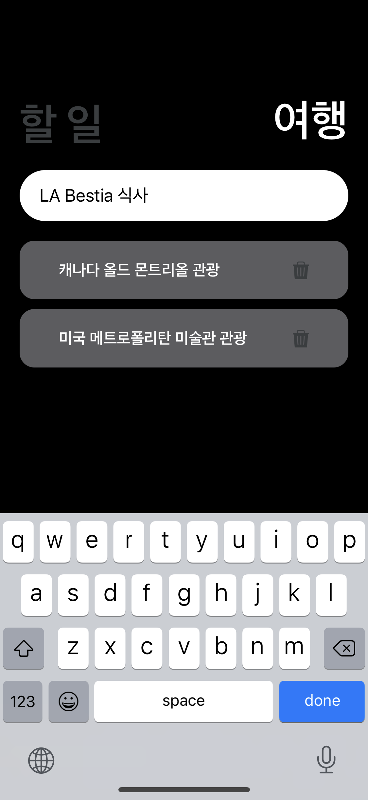
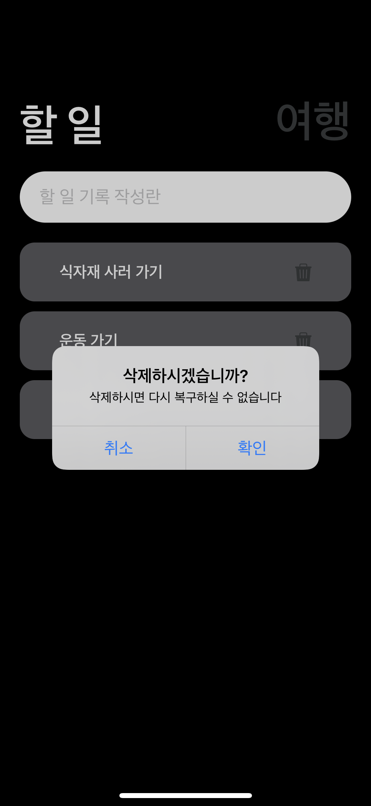

## 기록장 앱

> 할 일과 여행 카테고리를 나누어 기록할 수 있게끔 만든 앱


[기록장 앱 구경하러가기](https://expo.dev/@leeseonyong/WorkHardTravelHardApp?serviceType=classic&distribut)







### Development


### Dependencies

``` json
"dependencies": {
    "@react-native-async-storage/async-storage": "~1.17.3",
    "expo": "~46.0.16",
    "expo-status-bar": "~1.4.0",
    "expo-updates": "~0.14.6",
    "gh-pages": "^4.0.0",
    "react": "18.0.0",
    "react-native": "0.69.6"
  }
```